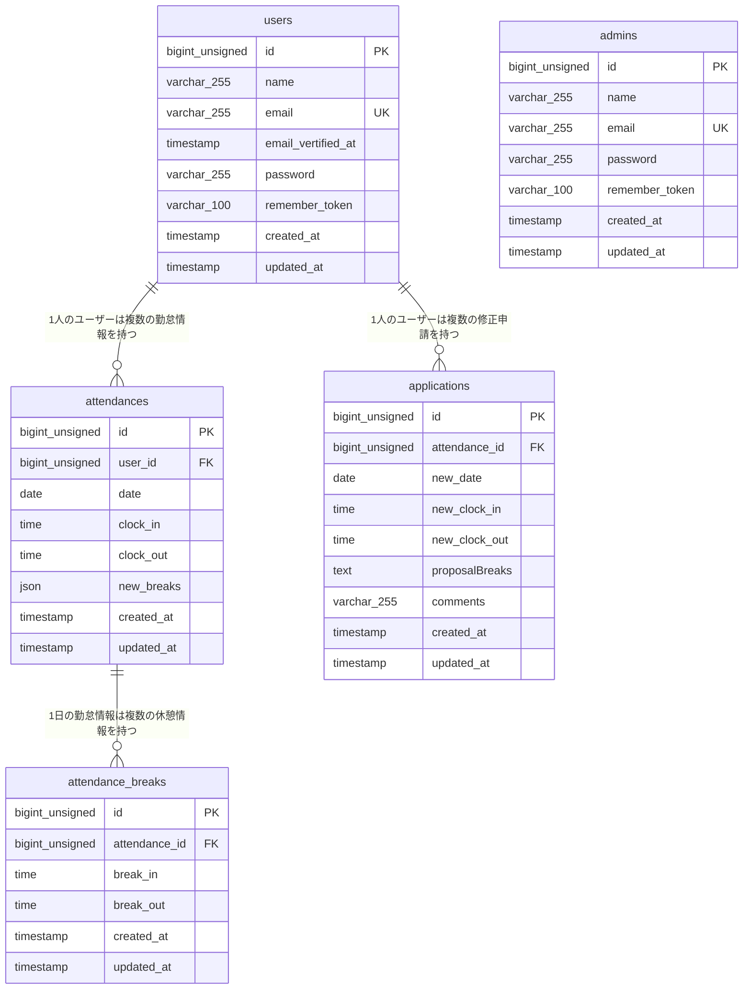

# アプリケーション名：勤怠管理アプリ
本システムは、一般ユーザーの勤怠と管理を目的とする独自の勤怠管理アプリです。<br>
一般ユーザーと管理者で完全に分離されたログイン同線を特徴とし、<br>
出退勤は1日1回、休憩は何度でも打刻できる設計を採用しています。<br>

## 主な機能一覧
本システムは、ユーザーの権限（一般ユーザー/管理者ユーザー）に応じて、<br>
利用可能な機能が分かれています。<br>

### 一般ユーザー(自身のユーザー情報に紐づいたデータのみ）
- 勤怠の打刻（現在の日時情報が24時間表記（9:05のように、1桁の時はゼロ埋めしない）で出力される）
- 勤怠一覧の確認
- 各勤怠の詳細確認
- 各勤怠の修正申請
- 修正申請一覧の確認

### 管理者ユーザー(全ユーザー情報のデータ)
- 勤怠一覧の確認
- 各勤怠の詳細確認
- 各勤怠の修正
- 各勤怠の修正承認
- 修正申請一覧の確認
- スタッフ一覧の確認
- スタッフ毎の月次勤怠一覧の確認

## 環境構築

1. リポジトリのクローン(bash)
```
git clone https://github.com/Ma-Namba/attendance-app.git
```

2. 環境設定ファイルの作成(bash)
.env.exampleをコピーして.envを作成する。
```
cd attendance-app
cp .env.example .env
```
.env ファイル内の以下のDB接続情報を確認・設定します。<br>
.env.example のデフォルト値はSail向けではないため、以下のように変更してください。
```
DB_CONNECTION=mysql
DB_HOST=mysql
DB_PORT=3306
DB_DATABASE=laravel
DB_USERNAME=sail
DB_PASSWORD=password

MAIL_MAILER=smtp
MAIL_HOST=mailpit
MAIL_PORT=1025
```

3. Laravel Sail（mysql, mailpit）のインストール(bash)

```
‌docker run --rm -u "$(id -u):$(id -g)" -v "$(pwd):/var/www/html" -w /var/www/html \
  laravelsail/php82-composer:latest \
  php artisan sail:install --with=mysql,mailpit
# Apple Silicon(M1/M2/M3/M4等)の場合は compose.yaml の mysql に「platform: 'linux/amd64'」を追記。
```

4. Dockerコンテナのビルドと起動(bash)

```
./vendor/bin/sail up -d
```

5. アプリケーションキーの生成(bash)

```
./vendor/bin/sail up -d
```

6. マイグレーションとシーダーの実行

```
./vendor/bin/sail artisan migrate:fresh --seed
```

7. フロントエンドのビルドと起動

```
‌./vendor/bin/sail npm install
./vendor/bin/sail npm run dev
```

8. 動作確認


ブラウザで以下のアプリケーションURLを開き、画面が表示されれば完了

[http://localhost](http://localhost)

## テスト実行
```
./vendor/bin/sail test
```
カバレッジ付きで実行する場合：
```
sail artisan test --coverage
```

## 使用技術
- PHP 8.2
- Laravel 10.x
- MySQL 8.0
- Nginx
- Docker / Docker Compose / Laravel Sail
- Vite / Tailwind CSS 3.4
- Laravel Fortify（認証）
- phpMyAdmin

## ER図


## URL
開発環境：http://localhost/
